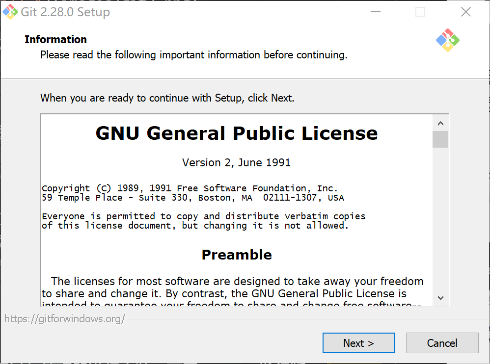
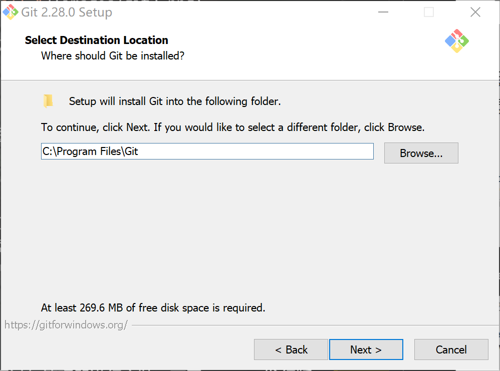
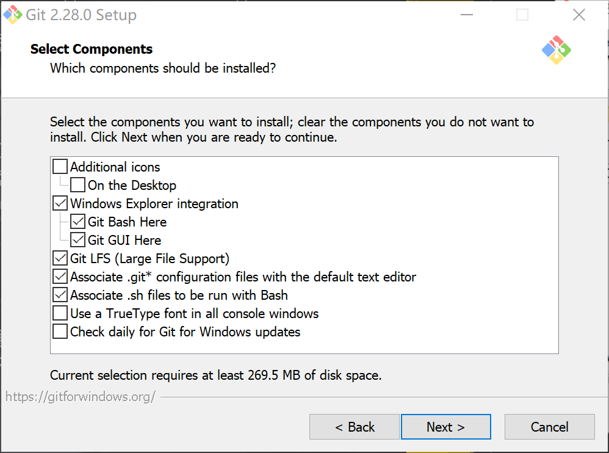
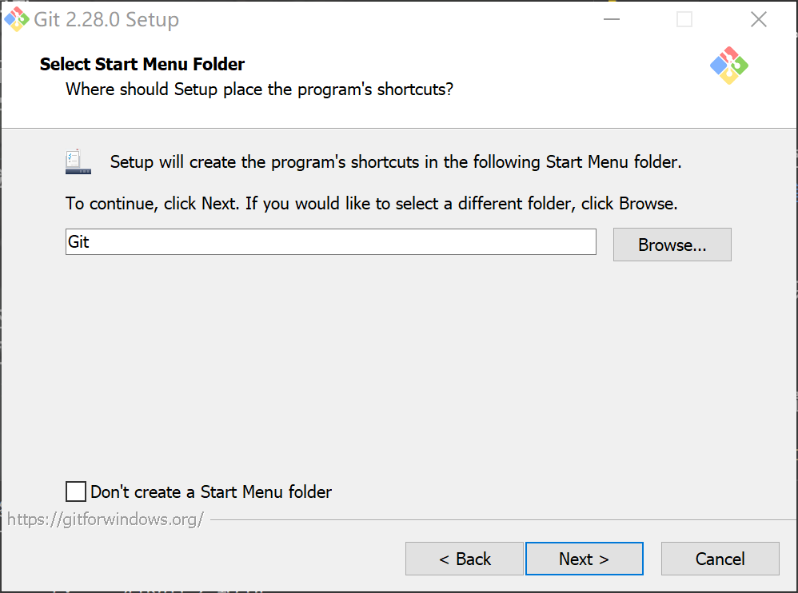
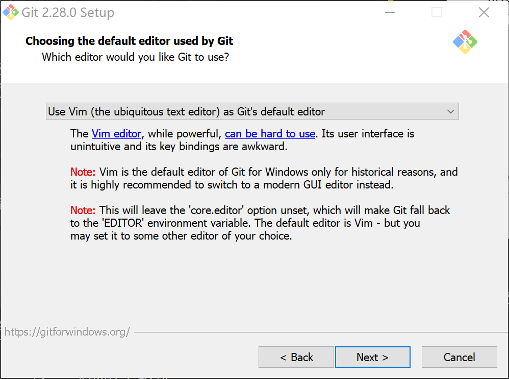
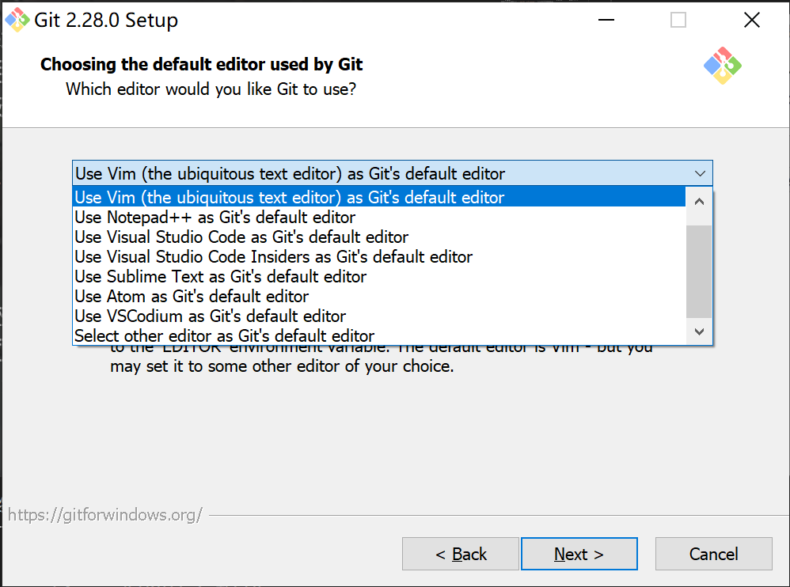
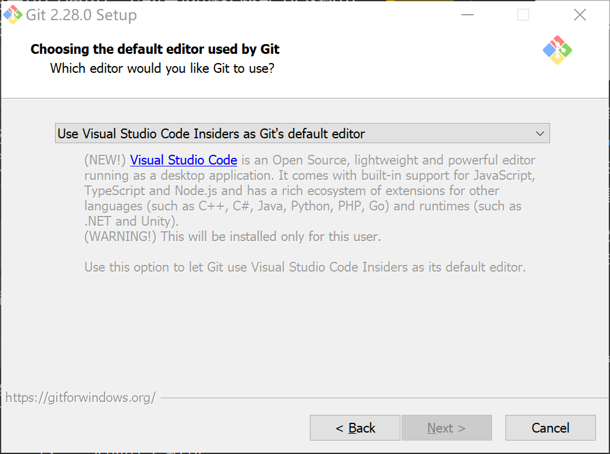
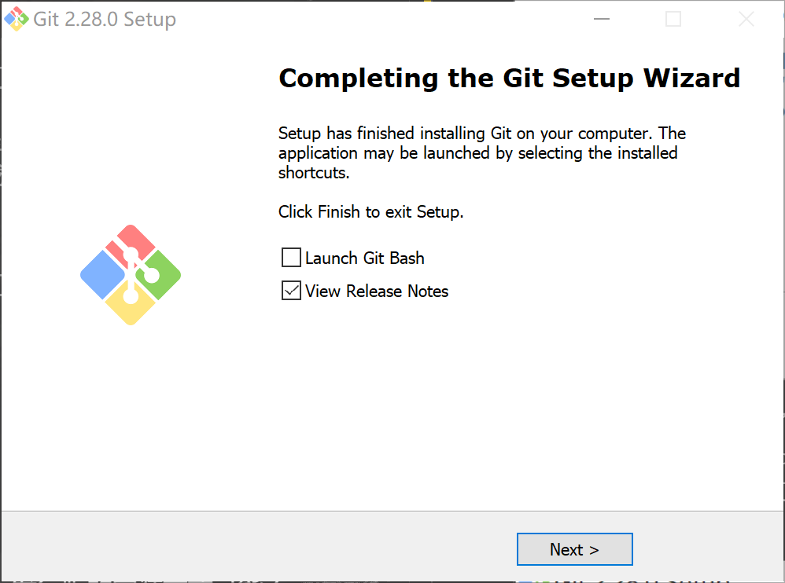

???+note
    本页面将着重介绍 Git 这一版本控制系统，与 GitHub 相关的内容，请参考 [GitHub 帮助](https://docs.github.com/cn) 和 [如何参与 - OI Wiki](https://oi-wiki.org/intro/htc/) 。

Git 是目前使用最广泛的版本控制系统。 **OI Wiki** 也使用了 Git 作为版本控制系统。

## 安装

### Windows

???+warning
    本节以 Git for Windows 2.28.0 （2020-07-27 更新）为例。安装页面的选项可能会随着时间而变动。

Windows 系统可以在 [Git 官网](https://git-scm.com/downloads) 获取到 Git for Windows （下文简称 Git）的安装包。

下载完成后，运行 Git 的安装程序。弹出的页面如下图所示。



点击 Next > ，选择安装路径。



点击 Next > ，选择安装可选项。



默认的选项如上图所示，均不建议取消勾选。其他未勾选的选项可以依照需求勾选。

??? note "各选项功能详解"

    默认勾选的选项：

    - `Windows Explorer integration` ：资源管理器集成（右键菜单）。
        - `Git Bash Here` ：在当前目录运行 Git 命令行。
        - `Git GUI Here` ：在当前目录运行 Git 图形化页面。
    - `Git LFS` ：安装 Git Large File Support（大文件支持）。[^note1]
    - `Associate .git* configuration files with the default text editor` ：将所有 `.git` 配置文件与默认文本编辑器关联，并用其打开。默认文本编辑器会在后面配置。
    - `Associate .sh files to be run with Bash` ：将所有扩展名为 `.sh` 的文件与 Git 命令行关联，并用其执行。

    ---

    默认不勾选的选项：

    - `Additional icons`
        - `On the Desktop`：让 Git 在桌面创建快捷方式。
    - `Use a TrueType font in all console windows` ：让 Git 在所有命令行（包括 cmd 命令行窗口）中都使用 TrueType 字体。
    - `Check daily for Git for Windows updates`：让 Git 每天检查更新。

点击 Next > ，选择存放 Git 快捷方式的开始菜单文件夹。若勾选 `Don't create a Start Menu folder`，则 Git 不会在开始菜单创建快捷方式。



点击 Next > ，选择默认的编辑器。



在下拉菜单栏中，Git 提供了 nano、[Vim](editor/vim.md)、[Notepad++](editor/npp.md)、[Visual Studio Code](editor/vscode.md)、Visual Studio Code Insider（VSCode 预览版）、Sublime Text、[Atom](editor/atom.md) 和 VSCodium 作为默认编辑器的预设方案。如果系统已经安装了上述的一种或多种编辑器，可以直接选择其中一种并进入下一步。另外，还可通过 `Select other editor as Git's default editor` 项手动指定默认编辑器。



除了 Vim 外，如果选择了尚未安装的编辑器，安装程序会阻止使用者进入下一步。[^note2] 用户可以通过给出的官网链接跳转到下载页面，完成编辑器的安装后继续安装 Git。



选好默认编辑器后，点击 Next > 进入下一步。

接下来的每一步都直接点击 Next >。当 Next > 变为 Install 时，按下 Install 进行安装。

最后，该页面出现，Git 安装完成。此时可以取消勾选 `View Release Notes` ，然后按下 Next > 直接退出；也可以直接按下 Next > 查看版本更新信息；亦可以勾选 `Launch Git Bash` 运行 Git 命令行。



### Linux

Linux 系统可以通过包管理器进行安装。不同 Linux 发行版的安装方式可能不同， [Git 官网](https://git-scm.com/download/linux) 给出了不同系统下的安装方式。

### Mac

Mac 系统只需在终端执行 `brew install git` 命令即可安装。

## 配置

Git 的配置文件，主要存储在三个位置：

1.  `/etc/gitconfig` ：该配置文件对系统上的所有用户，以及该系统上的所有仓库均有效。
2.  `~/.gitconfig` ：该配置文件对系统的当前用户，以及该系统上的所有仓库有效。
3. 当前仓库目录下的 `.git/config` 文件：只适用于该仓库。

局部设置会自动覆盖全局设置。因此如果需要在某个仓库应用特定的设置的话，只需更改该仓库下的特定设置即可，不会对全局设置造成影响。

修改配置文件需要用到 `git config` 命令。

### 设置用户信息

安装 Git 后，第一件事情就是设置你的用户名和邮箱。这些信息在每次提交时都会用到。

```bash
$ git config --global user.name "OI Wiki"
$ git config --global user.email hi@oi-wiki.org
```

这里的 `--global` 表示修改的是 `~/.gitconfig` 文件，即该设置对当前用户下的所有仓库均有效。

如果想要修改某个仓库的特定设置，只需在该仓库下执行不带 `--global` 的命令即可。

### 配置编辑器

```bash
$ git config --global core.editor emacs
```

执行如上命令可以将编辑器更改为 [Emacs](./editor/emacs.md) 。

在 Windows 下，配置编辑器的过程可能会稍有麻烦，具体配置方式可以在网络上查找相关资料。

### 显示配置

可以通过 `git config --list` 列出当前已经设置的所有配置参数。

## 仓库操作基础

### 新建 Git 仓库

新建一个 Git 仓库非常简单，只需在你想要建立仓库的文件夹输入如下命令：

```bash
$ git init
```

Git 将在当前文件夹新建一个 `.git` 文件夹，一个仓库就这样建好了。

如果别人已经建立了一个仓库，你想要把这个仓库拷贝到自己的电脑上（比如将 **OI Wiki** 的代码拷贝到本地上进行编辑），采用 `git clone` 命令即可。

```bash
$ git clone https://github.com/OI-wiki/OI-wiki.git
```

这样在当前文件夹下，就会新建一个名为 `OI-wiki` 的仓库，里面存放着原来仓库的所有信息。

### 跟踪文件

在我们对仓库做出了一些修改后，我们需要将这些修改纳入版本管理当中去。

使用 `git status` 命令可以查看当前仓库文件的状态。

假设我们在一个空仓库中新增了一个 `README.md` 文件，执行 `git status` 命令的效果如下：

```bash
$ mkdir test
$ cd test
$ git init # 在 test 文件夹下建立一个新仓库
$ vi README.md # 写点东西
$ git status
On branch master

No commits yet

Untracked files:
  (use "git add <file>..." to include in what will be committed)

        README.md

nothing added to commit but untracked files present (use "git add" to track)
```

这里的 Untracked files 指的是 Git 之前没有纳入版本跟踪的文件。如果文件没有纳入版本跟踪，我们对该文件的修改不会被 Git 记录。

执行 `git add <文件>` 命令可以将指定的文件纳入到版本跟踪中。

```bash
$ git add README.md # 将这个文件纳入到版本跟踪中
$ git status
On branch master

No commits yet

Changes to be committed:
  (use "git rm --cached <file>..." to unstage)

        new file:   README.md
```

这时 `README.md` 已经纳入了版本跟踪，放入了暂存区。我们接下来只需执行 `git commit` 命令就可以提交这次更改了。

但在我们干这个之前，先让我们再对 `README.md` 做点小修改。

```bash
$ vi README.md # 再随便修改点东西
$ git status
On branch master

No commits yet

Changes to be committed:
  (use "git rm --cached <file>..." to unstage)

        new file:   README.md

Changes not staged for commit:
  (use "git add <file>..." to update what will be committed)
  (use "git checkout -- <file>..." to discard changes in working directory)

        modified:   README.md
```

你会发现 `README.md` 同时处于暂存区和非暂存区。如果这时候执行 `git commit` 命令，只有处于暂存区的更改会被提交，而非暂存区的修改，则不会被提交。

git 的提示告诉我们，执行 `git add README.md` 就可以将非暂存区的更改放入暂存区了。

现在我们将非暂存区的文件加入暂存区，将所有更改一并提交。

```bash
$ git add README.md
$ git commit # 接下来会弹出编辑器页面，你需要写下 commit 信息
[master (root-commit) b13c84e] test
 1 file changed, 2 insertions(+)
 create mode 100644 README.md
```

我们现在重点观察一下 commit 的信息。

 `master` 表示当前位于 `master` 分支（关于分支的问题，下文将会详细介绍）， `b13c84e` 表示本次提交的 SHA-1 校验和的前几位，后面则是本次提交的信息。

需要特别关注的是这里的 SHA-1 校验码，每个校验码都与某个时刻仓库的一个快照相对应。利用这一特性我们可以访问历史某个时刻的仓库快照，并在该快照上进行更改。

接下来两行则详细说明了本次更新涉及的文件修改。

另外，commit 过程中可以利用几个参数来简化提交过程：

-  `-a` ：自动将非暂存区内的提交放入暂存区，然后提交暂存区中的所有更改。需要注意的是未被跟踪的文件（新创建的文件）不会被自动加入暂存区，需要用 `git add` 命令手动添加。
-  `-m` ：该参数后跟提交信息，表示以该提交信息提交本次更改。

### 查看提交记录

使用 `git log` 命令可以查看我们的提交历史记录[^note3]。

可以看到，提交历史里记录了每次提交时的 SHA-1 校验和，提交的作出者，提交时间和 commit 信息。

```bash
$ git log
commit cf78ab3c198337acf508d90924328d476c2e5783 (HEAD -> master)
Author: OI Wiki <hi@oi-wiki.org>
Date:   Fri May 10 22:39:27 2019 +0800

    update README.md

commit b13c84ee799c0fc4c3420814d95c03ea1823ebe3
Author: OI Wiki <hi@oi-wiki.org>
Date:   Fri May 10 22:25:56 2019 +0800

    test
```

### 分支管理

为什么版本管理中需要分支管理呢？答案主要有两点：

1. 直接修改主分支不仅会使历史记录混乱，也可能会造成一些危险的后果。
2. 通过分支，我们可以专注于当前的工作。如果我们需要完成两个不同的工作，只需开两个分支即可，两个分支间的工作互不干扰。

利用 `git branch` 命令可以创建分支， `git checkout` 命令可以切换分支。

```bash
$ git branch dev # 创建一个叫做 dev 的新分支
$ git checkout dev # 切换当前分支到 dev
Switched to branch 'dev'
$ git branch # 查看所有分支信息
  master
* dev
```

???+note "更快速地切换分支"
    上面的操作需要执行两条命令，事实上只需要一条命令就够了。
    
    执行 `git checkout -b dev` 就可以在创建 dev 分支的同时，将当前分支切换到 dev。

dev 前面的星号代表我们当前的分支为 dev，我们的修改都将记录在这个分支上。

我们可以在这个分支上做点小修改，比如创建一个新文件 `test.cpp` 。

```bash
$ vi test.cpp
$ git add test.cpp
$ git commit -m "QAQ"
[dev 4fe4923] QAQ
 1 file changed, 8 insertions(+)
 create mode 100644 test.cpp
```

在新分支上修改似乎和在 master 分支上修改没什么太大区别，事实上也确实如此，每个分支都是平等的。

## 参考资料与注释

[^note1]:  在某些地方（比如 [LFS 官网](https://git-lfs.github.com/)）又被称作 Git Large File Storage（大文件存储）。它在将项目托管到平台上时，用文本指针代替音频、视频、图像、数据集等大文件的原始文件，从而加快传输速度。对移动应用程序开发人员、游戏工程师以及任何需要大文件构建软件的人，该功能都极为实用。若想进一步了解该功能，可以参考 [Atlassian 官方介绍 Git LFS 的译文](https://www.cnblogs.com/cangqinglang/p/13097777.html)。

[^note2]: 但是，Git 对 Vim 的描述是“虽然强大，但是难以使用。用户界面反人类，键位映射卡手。Git 使用 Vim 作为默认编辑器只是出于历史原因，强烈推荐换用一个 UI 设计现代化的编辑器。”，并给“难以使用”加上了 [“StackOverflow 每年帮助一百万名开发者退出 Vim”的页面链接](https://stackoverflow.blog/2017/05/23/stack-overflow-helping-one-million-developers-exit-vim/)。

[^note3]:  `git log` 的更多用法可以参考 [Pro Git Book v2](https://git-scm.com/book/zh/v2/Git-%E5%9F%BA%E7%A1%80-%E6%9F%A5%E7%9C%8B%E6%8F%90%E4%BA%A4%E5%8E%86%E5%8F%B2) 。
